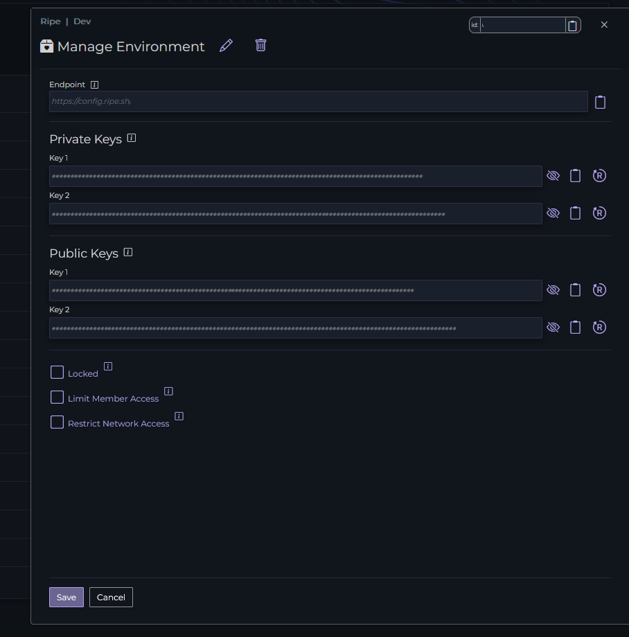

## Connecting to the Ripe Service

Connecting to Ripe is easier than ever! You can keep an eye on our [SDK's](https://github.com/Ripe-Inc/ripe-sdks) to see if we support your language, if not, then you can connect with a simple HTTP request

Regardless of your connection preferences, you'll need your environment information. 

Navigate to the [Ripe App](https://app.ripecloud.io) and click on the gear next to your chosen environment for the environment settings dialog to appear

From here you can get all the information to connect to an environment. You'll need the **Endpoint** value and one of the **Private Keys** values to connect.

### Connecting with an HTTP Request

1) Using your client of choice, set the enpoint to the **Endpoint** value in your environment settings dialog. 
2) Set a header called `x-ripe-key` and use the value from **Private Keys** as the value
3) Ensure the `Content-Type` header is set to `application/json` and that the request is `POST`
4) Your post body will look like the following with your own keys and version

```json
{
    "version": "1.0.0", //Your application version
	"schema": [ //The keys you'd like Ripe to respond with values for
        "TestBoolDefault",
        "Section1.TestDecimal",
        "Section1.TestString",
        "Section2.TestIntDefault",
        "Section2.TestDecimalDefault"
	]
}
```

Making this request will respond with the following:

```json
{
    "Data": {
        "TestBoolDefault": false,
        "Section1": {
            "TestDecimal": 3.14159265,
            "TestString": "hello"
        },
        "Section2":{
            "TestIntDefault": 0,
            "TestDecimalDefault": 0
        },
        "ApiVersion": "0.6.609.1641",
        "LastModified": "2024-06-06T19:36:00.0508332+00:00"
    }
}
```