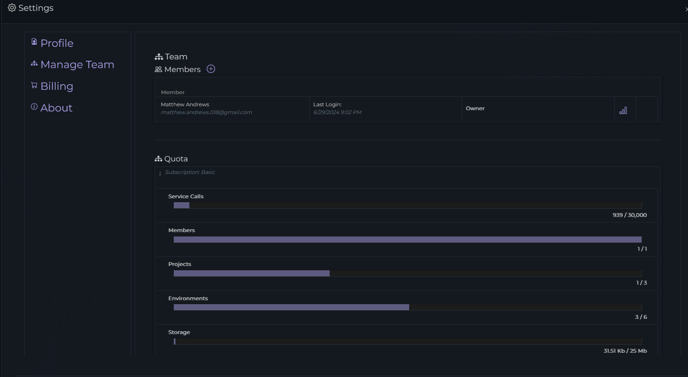
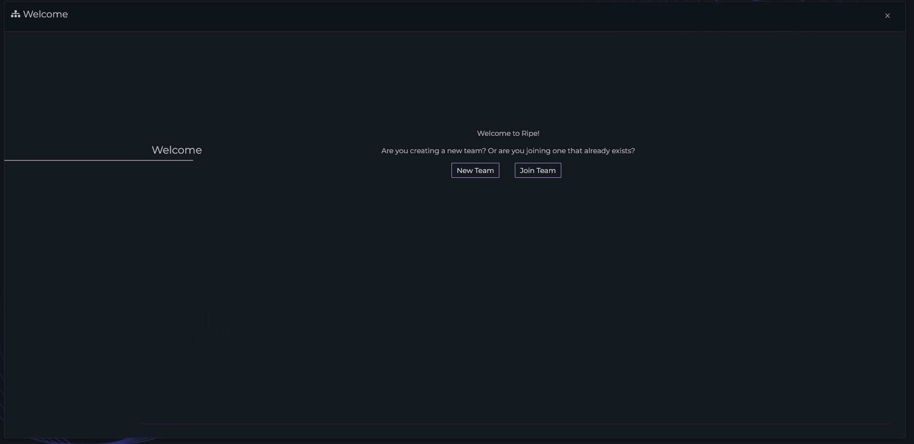
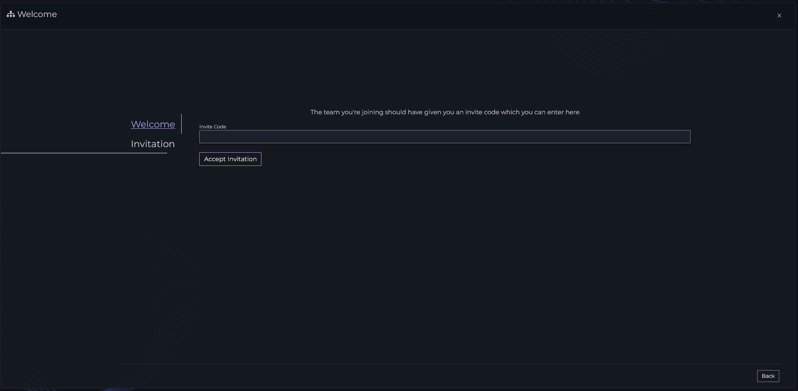

# Joining an existing team

Joing a team in Ripe requires an owner or administrator of the team to initialize the invitation.

### As an owner/administrator
From the Ripe web application, click on the 'Settings' gear in the navigation bar. Then select 'Manage Team' to show team settings.

Next to the 'Members' title, press the `+` button, and enter in the email address of the user you wish to invite.

### As a user
Once the owner/administrator has invited you to their team, you should receive an 
email invitation. Clicking on the button in the invitation email will bring you to Ripe to create your login and join the team.

Alternatively, when creating a team there is an option to enter the invite code sent in the invitation email:

From the welcome page, click on 'Join Team'

You can enter the invitation code here and press 'Accept Invite'