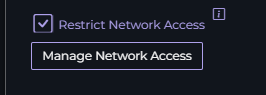

# Network Access

In an environment you can limit the network access to your configuration endpoint. Enabling this setting will block access to the configuration endpoint unless it comes from a specific IP Address.

You can enable this by navigating to the Environment Management dialog by clicking the gear icon next to Environments in the navigation bar. Enable `Restrict Network Access` and use the `Manage Network Access` button to configure.

The dialog will now be visible

You can configure a specific IP Address, an IP Address range by clicking the `Range` checkbox, or use an IP Address with the wildcard operator. 

{: .note }
You can save by pressing the `x` in the top corner of the dialog, and then saving the environment. You must save the environment for the changes to take effect.

{: .warning }
Once you save the environment, any IP Addresses that don't match while `Restrict Network Access` is on will return a 403 Forbidden when accessing the environment endpoint!