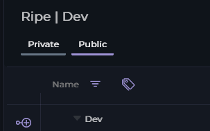
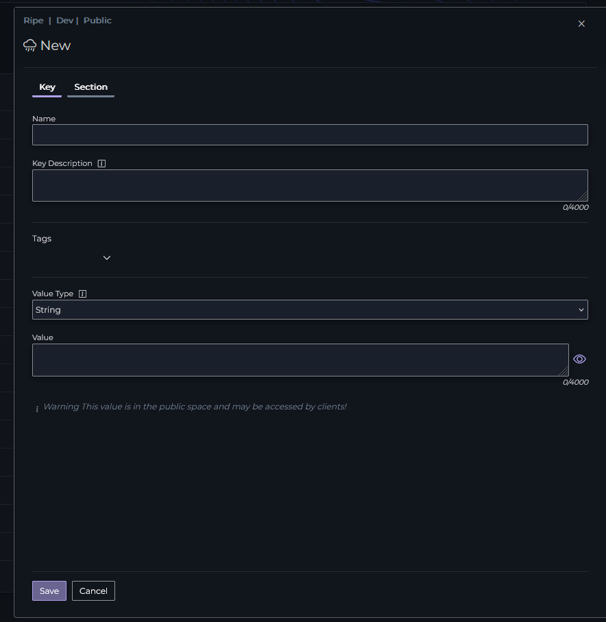

# Creating a Key

Creating a Key in Ripe is a simple process. First, login to [Ripe](https://app.ripecloud.io). Once you're logged in and have selected the correct environment, press the `+` button to the left of the section you're adding the key to:

> [!WARNING]
>
> Ensure that you confirm the expected visibility type (Private|Public) before creating the key. Once you've created the key, it must be deleted to change visibility!

{: .note-title }
> Note
>
> Once a key is created, it exists in any environment within the project, with the default value determined by the value type chosen. Anything set in this dialog can be changed, except for the **Key's name** and the **Value Type**

From here you must set the name for the key. The key can be nested, either by selecting the 'Section' tab and creating a new section, or you can use dot notation in your name, such as `My.Key`.

{: .note-title }
> Note
>
> Key name is only allowed characters `a-Z` and `.`. Key names must be fully unique regardless of casing, and a key cannot exist where a section exists.

You can also set some optional information as part of Key creation. You can set a description, which is used for adding context as to what the key is for. **Tags** can be used to help with organizing your keys.

Before saving you should set the **Value Type** of your key. There are several options, each with their own default values

Type|Default
-|-
String|` `
Boolean|`false`
Integer|`0`
Decimal|`0`
JSON|`{}`

{: .warning-title }
> Warning
>
> Ensure you've chosen the correct **Value Type**, once you've created the key you cannot modify this value!

Last but not least, if you'd like, you can set a value for this key in the working environment.