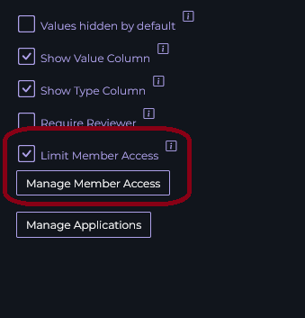
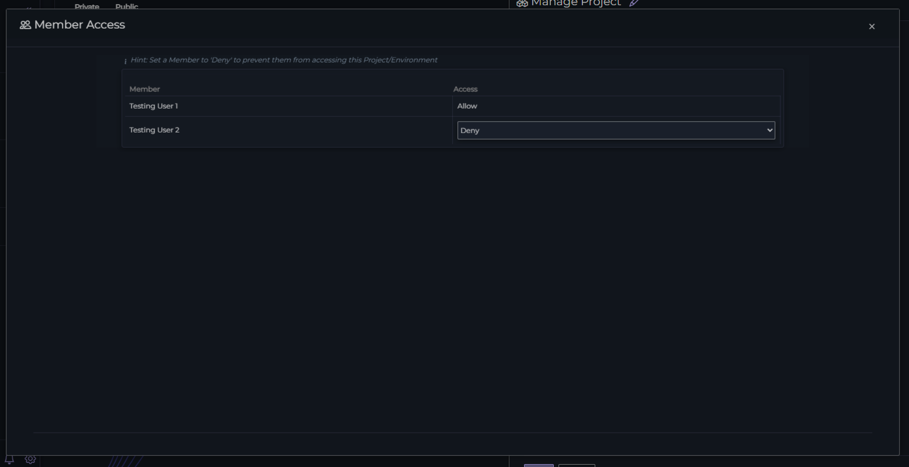

# Member Access

In a Project, you can limit the member access to only specific members in your team. This is useful in situations where you want to segregate different departments/responsabilities between different projects.

You can modify the member access in the Project Settings dialog, by pressing the gear icon next to Projects in the navigation menu.

First, you must enable the `Limit Member Access` option in the project settings. This will display a button which opens the Member Access dialog.

From the Manage Member Access dialog you can set specific members to `Allow` or `Deny` based off of your preferences. 

{: .new }
Once you've made your changes to this dialog, close it by pressing the `x` in the top right corner of the dialog. Then you must Save the project for the changes to take effect.

{: .warning }
Once you enable the `Limit Member Access` checkbox in a project, users who are set to `Deny` will no longer access any of the content in the project, regardless or their role.