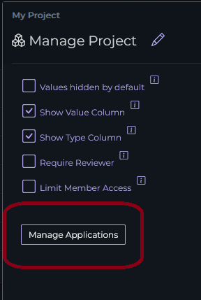
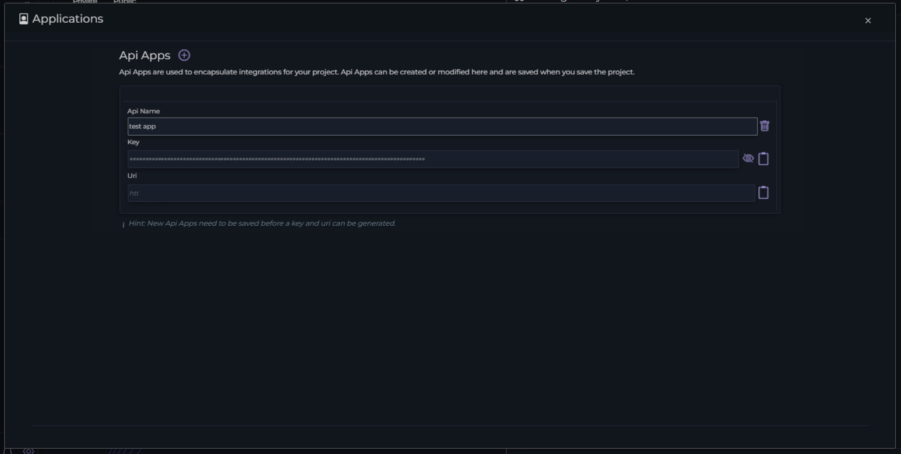

# Manage Applications

Applications in Ripe are extra API access to perform operations that you'd normall perform through the web app, but instead through a CLI or script. Applications allow you to build automated pipelines that trigger specific actions in your Ripe project, without having to expose your login information.

*Documentation for applications is currently under development*

To create an application, navigate to the Project Management dialog by click the Gear icon next to the projects section of the navigation menu.

Pressing on the Manage Applications button will open up the dialog.

From this dialog you can press the `+` button in the header to create a new app.

{: .note }
You cannot see the URI or Key for an application until you've saved the Project!

Once the project has been saved, you can use the credentials for the application in your API calls.