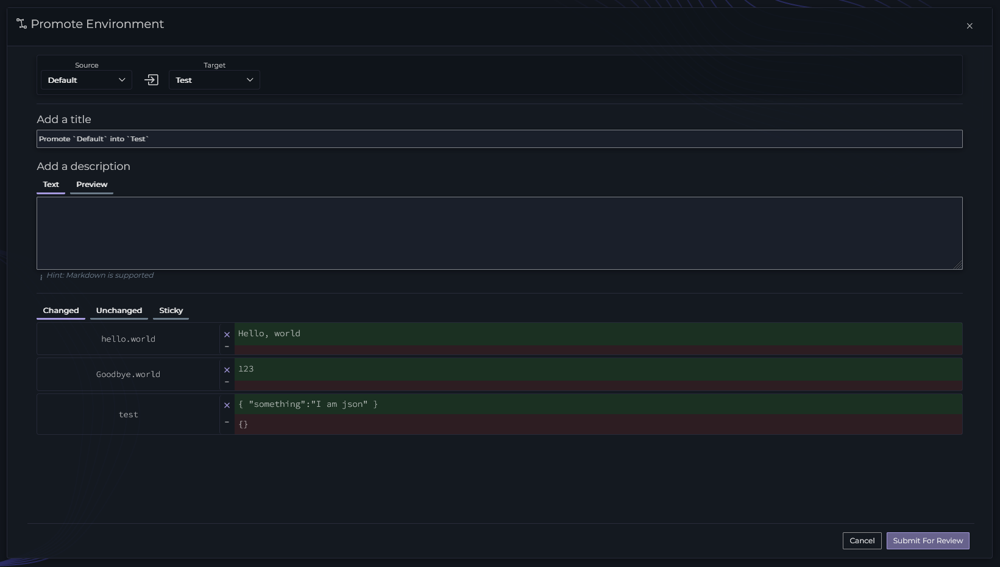
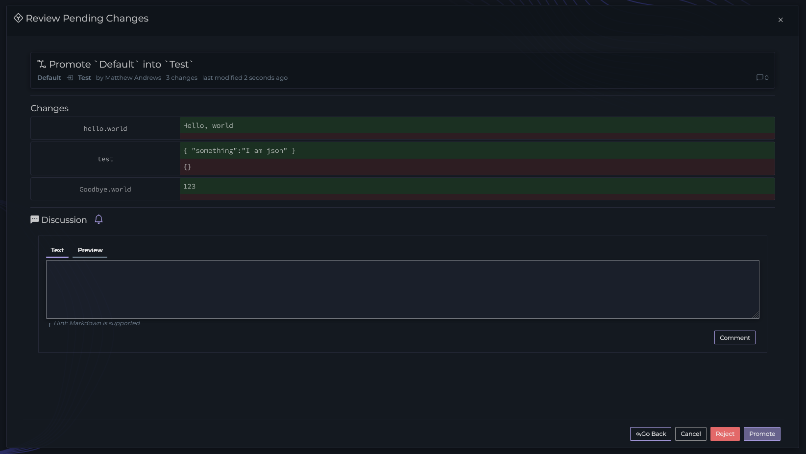

# Promotions

Promotions in Ripe are a controlled way to move values from one environment to another within a project. This enables your team to to take care with sensitive environments, ensuring that the right values make it to the right place.

## Creating a Promotion

To create a promotion, you must have more than one environment in a project. To start, press the `Promotion` button in the top bar of your environment. This will open up the Promotion Dialog where you can chose the source and target environment.

Once you've selected a target environment, the rest of the dialog will display

From here you can customize the title of your promotion, add a description of why you're proposing the changes, and you can view the proposed changes.

You can customize the values that you'd like to include in this promotion. Note the changes grid, there are two values displayed for each key, one highlighted in green and one in red. The top value is the source value, and the bottom value is the target to be overwritten. If you press the button to the left of the value you can ignore that change. This is useful if you'd like to keep a value in the target environment.

You can also click on the `Unchanged` tab to see all key/values that are identical and won't change. You can click on the `Sticky` tab to see all the values that won't be changed because the target value is set to `Sticky` (read more about that [here](anatomy-of-a-key))

Once you're satisfied that all the values are correct, press the `Submit For Review` button.

{: .warning }
Once a promotion is created, a snapshot is taken of all the values in the source environment. If changes are made to an environment after a promotion is created, those changes will not propagate to the promotion.

## Reviewing a Promotion

A Promotion that has been submitted must be reviewed and approved for the Promotion to take effect.

{: .note }
If you have the [Require Review](./projects/index) setting on your project enabled, the reviewer must be someone other than the creator of the promotion

To review a promotion, click on the `Reviews` button in the top of your environment, then select a promotion to review.

As a reviewer you can verify that the new values look correct for the target environment. You can use this place to discuss changes with the team, and you can either `Reject` or `Promote` the Promotion with the buttons in the bottom right. 

Rejecting the promotion will close it without applying the changes. This should be used when the promotion has incorrect or incomplete values. A promotion would have to be created again if rejected.

Promoting the Promotion will apply the changes to the target environment.