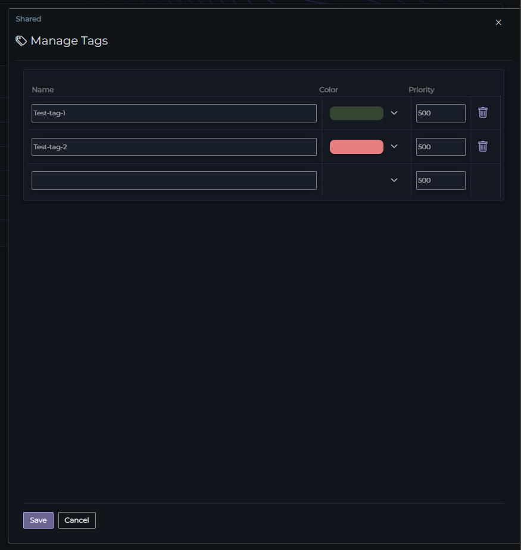
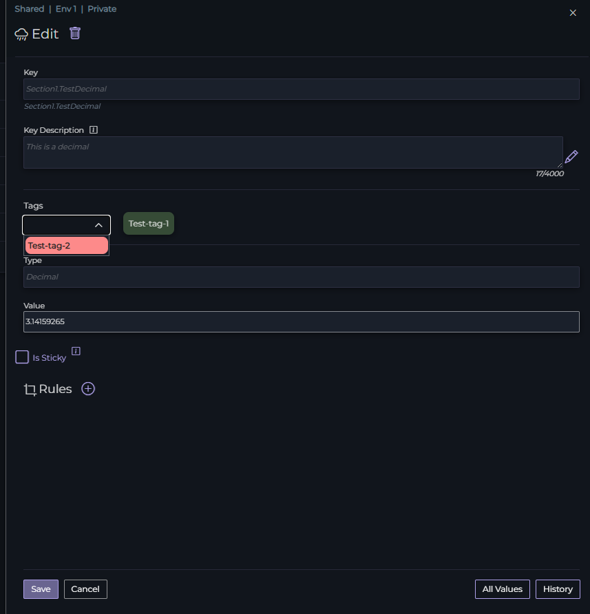

# Tags

Tags in Ripe are a useful tool for organizing your configuration. You can create tags by clicking the Gear icon next to the Tags section in the navigation bar

Here you can create a tag by entering text into the empty slot. You can chose a background color and set a custom Priority value.

{: .new }
The Priority is the order that the tag will show in a tag dropdown menu

Once you've created your tags, you can apply them to a key in the Edit Key dialog

Tags are visible next to your keys in the environment view, and you can filter by tag using the tag icon in the top bar of the environment